### AOTF2618L

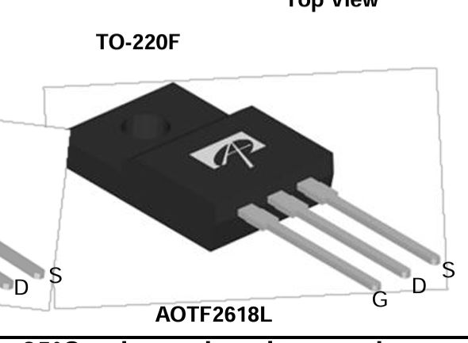

**30V • 100A • 0.0028Ω RDS(on) @ 4.5V**

* ~ $2.00 each  
* [Datasheet](https://aosmd.com/res/data_sheets/AOTF2618L.pdf)

| Pros | Cons |
|------|------|
| Extremely low RDS(on) | Harder to source locally |
| Excellent for higher stall motors/pumps | Typically used in SMD, TH versions rarer |
| Logic-level gate drive | May require heatsinking under high load |
---

### FQP30N06L

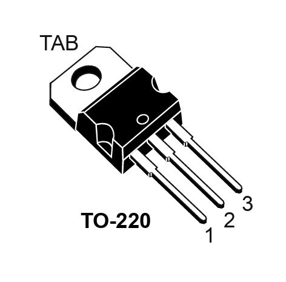

**60V • 32A • 0.035Ω RDS(on) @ 5V**

* ~ $2 each  
* [Datasheet](https://www.onsemi.com/pdf/datasheet/fqp30n06l-d.pdf)

| Pros | Cons |
|------|------|
| Fully enhanced at 4.5–5V gate | Higher RDS(on) than newer FETs |
| Common, cheap, and available | TO-220 is large physically |
| Great for 9–12V motors/pumps | May need heatsink at high duty |
---

### IRLZ34N

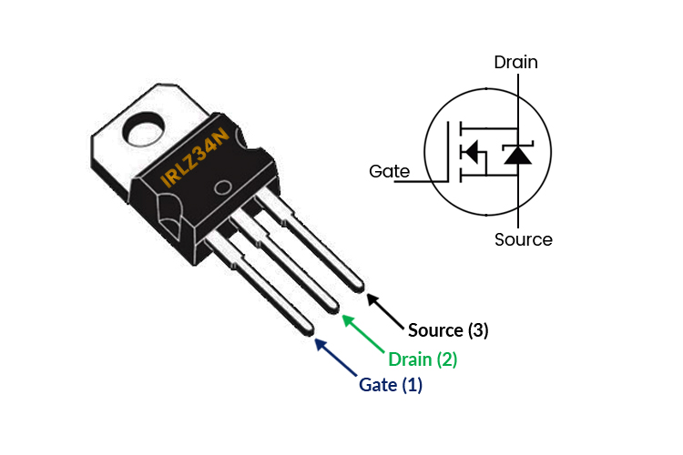

**55V • 30A • 0.04Ω RDS(on) @ 5V**

* ~$2 each  
* [Datasheet](https://www.infineon.com/dgdl/irlz34n.pdf?fileId=5546d462533600a40153563b9b7ac710)

| Pros | Cons |
|------|------|
| Good balance of low RDS(on) and driveability | Not as common as IRLZ44N |
| Lower gate charge than IRLZ44N | Slightly more loss vs IRLZ44N |
| Stable switch for medium current loads | |
---

### IRLZ44N

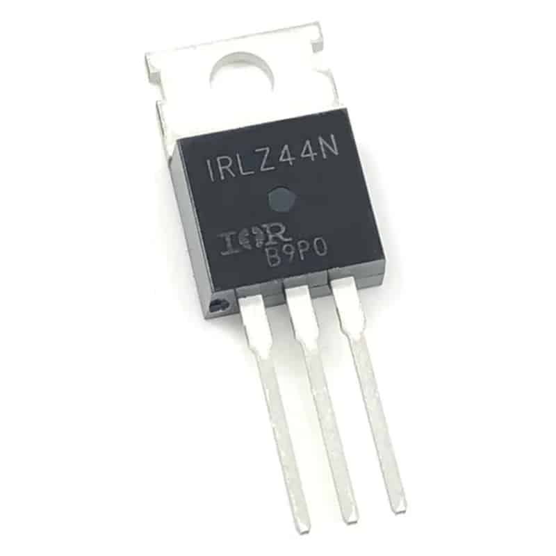

**55V • 47A • 0.022Ω RDS(on) @ 5V**

* ~ $4 each  
* [Datasheet](https://www.infineon.com/dgdl/irlz44n.pdf?fileId=5546d462533600a40153563b9b7a262f)

| Pros | Cons |
|------|------|
| Extremely common and proven reliable | High gate charge (needs stronger drive at high PWM) |
| Runs cool under load | Oversized for tiny motors |
| Great for 9V/12V inductive loads | |
---

### RFP30N06LE

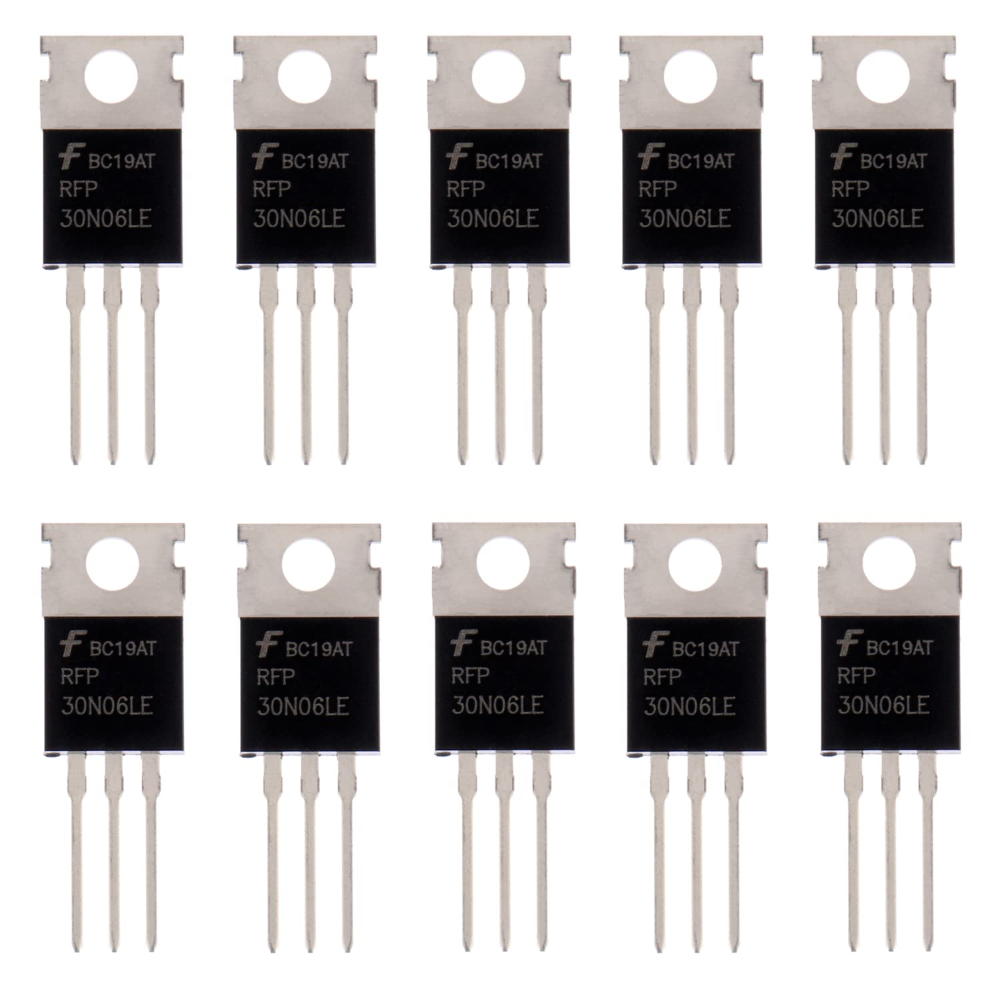

**60V • 30A • 0.047Ω RDS(on) @ 4.5V**

* ~$2.50 each  
* [Datasheet](https://mm.digikey.com/Volume0/opasdata/d220001/medias/docus/843/RFP30N06LE_RF1S30N06LESM.pdf)

| Pros | Cons |
|------|------|
| Lower dissipation at 4.5V than many older FETs | Less stocked than IRL series |
| Fully logic-level compatible | Slightly higher RDS(on) than IRLZ44N |
| Easy alternative to FQP30N06L | |
---

### STP36NF06L

**60V • 30A • 0.025Ω RDS(on) @ 5V**

* ~ $3 each  
* [Datasheet](https://www.st.com/resource/en/datasheet/stp36nf06l.pdf)

| Pros | Cons |
|------|------|
| Automotive-grade ruggedness | Slightly more expensive |
| Very strong for inductive loads | Harder to find in hobby stores |
| Good thermals, safe for pumps/motors | |
---

### Choice:
Option 1: AOFT2618L
# Reason:
It is a class-supplied MOSFET that can perform the duties required for this project. If something were to fail during prototyping, it would be much easier to replace with minimal lead time. The cost of the component is negligible at this stage because the pricing of similar components is nearly identical. If produced on a mass scale, cost reduction efforts would focus on optimizing price-to-performance.

### Pumps
### Adafruit 4546 (Mini Submersible Pump)

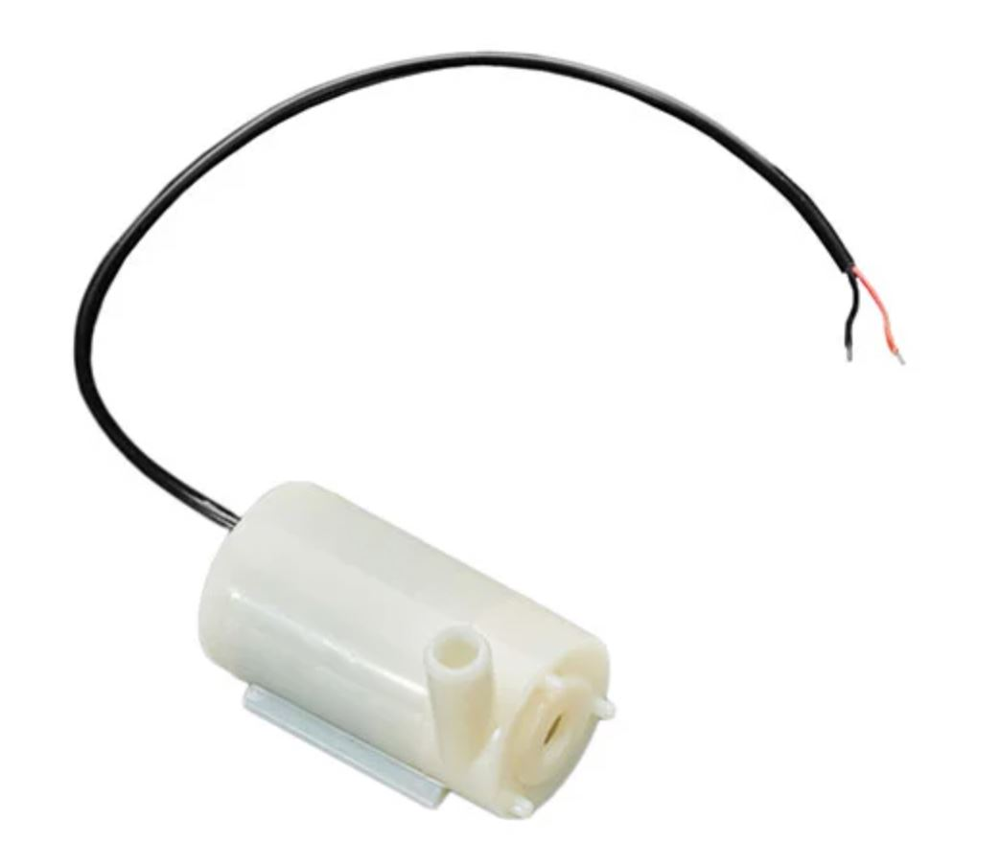

**3V • ~100mA • Low head / small flow (micro-pump class)**

* ~\$7.95 each  
* [Product Page](https://www.adafruit.com/product/4546)

| Pros | Cons |
|------|------|
| Extremely compact | Very small flow rate |
| Easy to prototype with | Limited head pressure|
| Quiet operation | Limited head pressure |
---

### Adafruit Peristaltic Liquid Pump (ID: 1150)

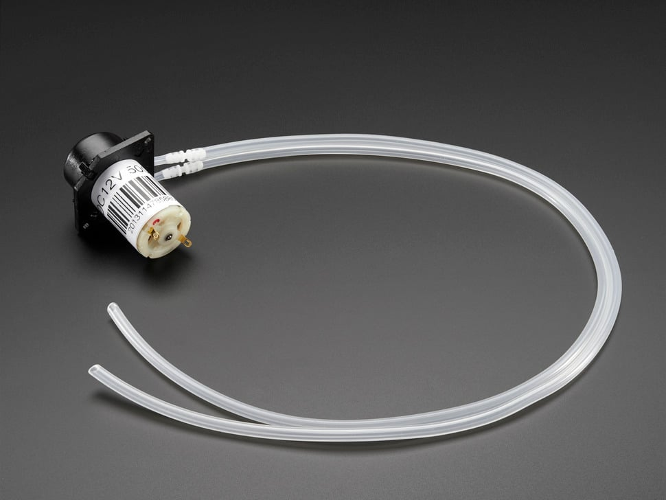

**5–6V • ~500mA • ~100mL/min (≈1.6 GPH) • Peristaltic**

* ~\$24.95 each  
* [Product Page](https://www.adafruit.com/product/3910)

| Pros | Cons |
|------|------|
| Fluid only touches tubing (sterile / clean) | Far below 30 GPH target |
| Self-priming & reversible | Expensive |
| Would be fun to use | Requires narrow tubing; adapters for 1/4" needed |
---

### Olimex Micro Water Pump

.jpg)

**3–12V • up to 1–2 L/min (≈16–32 GPH) • ~1.5A draw**

* ~\$3.52 each  
* [Product Page](https://www.olimex.com/Products/Components/Misc/MICRO-WATER-PUMP/)

| Pros | Cons |
|------|------|
| Capable of reaching 30 GPH target | 3mm outlet → needs adapter for 1/4" tubing |
| Works at 9V from supply | Flow drops quickly with head |
| Extremely inexpensive | No built-in filtering |
---

### Choice:
Option 3: Olimex Micro Water Pump
# Reason:
This pump provides a good price-to-performance balance. A peristaltic pump would likely better fit our needs, but its cost would take a significant portion of our budget and is not feasible. The higher flow rate comes at the cost of a higher current draw, but it will allow the pump to run for a shorter amount of time per watering. 

### Adafruit 2941 — DC Motor in Micro Servo Body

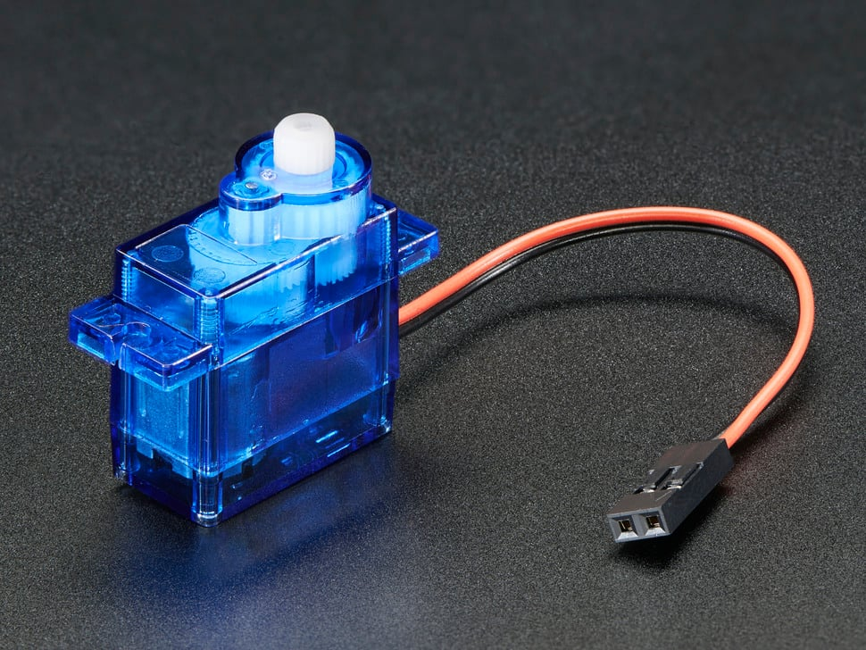

**4–6V • Small geared DC motor • Requires H-Bridge for forward/reverse**

* ~$3.50 each  
* [Product Page](https://www.adafruit.com/product/2941)

| Pros | Cons |
|------|------|
| Compact and easy to mount | Low torque |
| Runs directly from 5V rail | Requires H-bridge driver |
| Great for prototyping | Plastic gears wear over time |
---

### Adafruit 3777 — TT Gearbox Motor

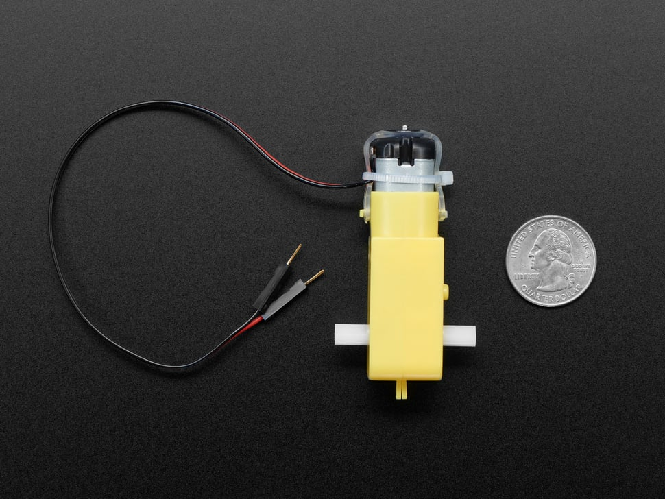

**3–6V • ~160mA no-load • ~1.5A stall • ~200RPM**

* ~$3.95–$5.95 each  
* [Product Page](https://www.adafruit.com/product/3777)

| Pros | Cons |
|------|------|
| Common and inexpensive | High stall current for size |
| Easy mounting | No built-in encoder |
| Great for robotics / prototyping | Plastic gearbox can wear |
---

### Pololu N20 Gearmotor (210:1 LP 6V)

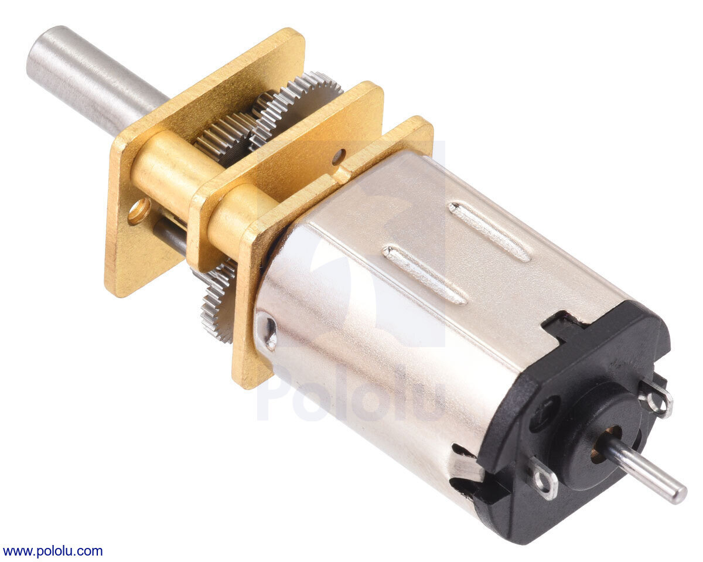

**6V • ~40–70mA no-load • ~0.36–0.67A stall**

* ~$12–$20 each  
* [Product Page](https://www.pololu.com/product/2206)

| Pros | Cons |
|------|------|
| Metal gearbox | Must avoid hard stall |
| Extremely compact | Requires coupler for shaft |
| Good efficiency / torque for size | Specs vary by ratio |
---

### FAN8100N — Dual H-Bridge Motor Driver

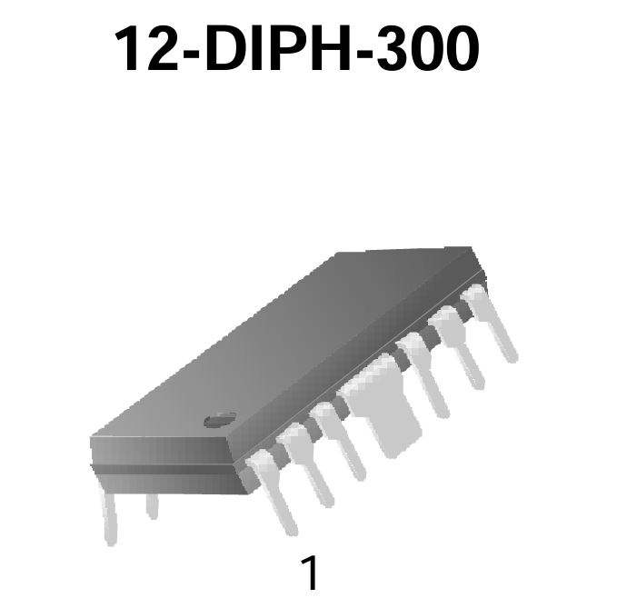

**1.8–9V Motor Supply • ~3A peak/ch • Bipolar H-bridge**

* ~$4–$10 each  
* [Datasheet](chrome-extension://efaidnbmnnnibpcajpcglclefindmkaj/https://mm.digikey.com/Volume0/opasdata/d220001/medias/docus/1021/FAN8100N%2CMTC.pdf)

| Pros | Cons |
|------|------|
| Simple to drive from MCU | Higher voltage drop than MOSFET bridges |
| Works well for 3–6V motors | Obsolete |
| - | Requires heat dissipation near stall |
---
**Adafruit 2941 — DC Motor in Micro Servo Body**

Selected for its compact servo-sized form factor, easy mounting, and compatibility with common 5V rails. It’s inexpensive for prototyping and pairs well with dual H-bridges (FAN8100N, L293D) for forward/reverse and PWM speed control. While torque is modest and gears are plastic, it meets the project’s size and simplicity goals for light-duty actuation.

### DRV8833 — Dual H-Bridge Motor Driver

### L293D — Dual H-Bridge Motor Driver (Through-Hole)

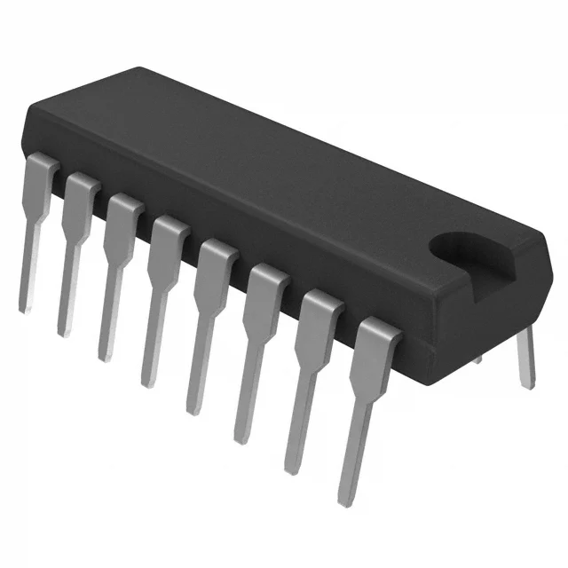

**4.5–36V Motor Supply • 600mA per channel (1.2A peak) • Bipolar H-bridge**

* ~$4–$8 each  
* [Datasheet](https://www.ti.com/lit/ds/symlink/l293d.pdf)

| Pros | Cons |
|------|------|
| DIP package (through-hole) — easy to proto | Larger voltage drop → runs warmer than MOSFET bridges |
| Built-in clamp diodes for inductive loads | Limited to ~600mA continuous per channel |
| Widely available, simple interface | Not ideal for very low-voltage, high-current stalls |
---

---

### L298N — Dual H-Bridge Motor Driver

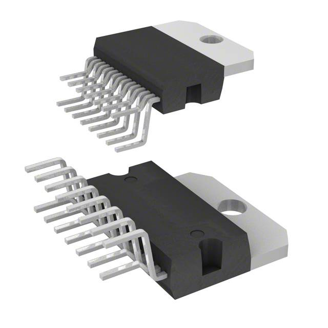

**Up to 46V Motor Supply • Up to 4A combined • Bipolar H-bridge**

* ~$6–$12 each  
* [Datasheet](https://www.st.com/resource/en/datasheet/l298.pdf)

| Pros | Cons |
|------|------|
| Very common + rugged | Large voltage drop (inefficient) |
| Easy to prototype with | Runs hot at low motor voltages |
| Good for learning setups | Physically bulky |
---

## Choice

**FAN8100N**

This driver was chosen because it can reliably power the 3–6V DC motors being considered while supporting both forward and reverse operation through a simple input interface. It provides sufficient stall-current tolerance for motors like the TT-geared model when thermals are managed. Although it is less efficient than MOSFET-based drivers and not as widely available, its DIP package, simplicity, and compatibility with low-voltage motors make it a suitable selection for prototyping.
