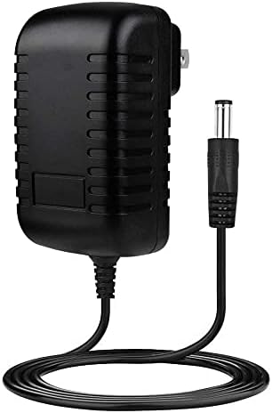
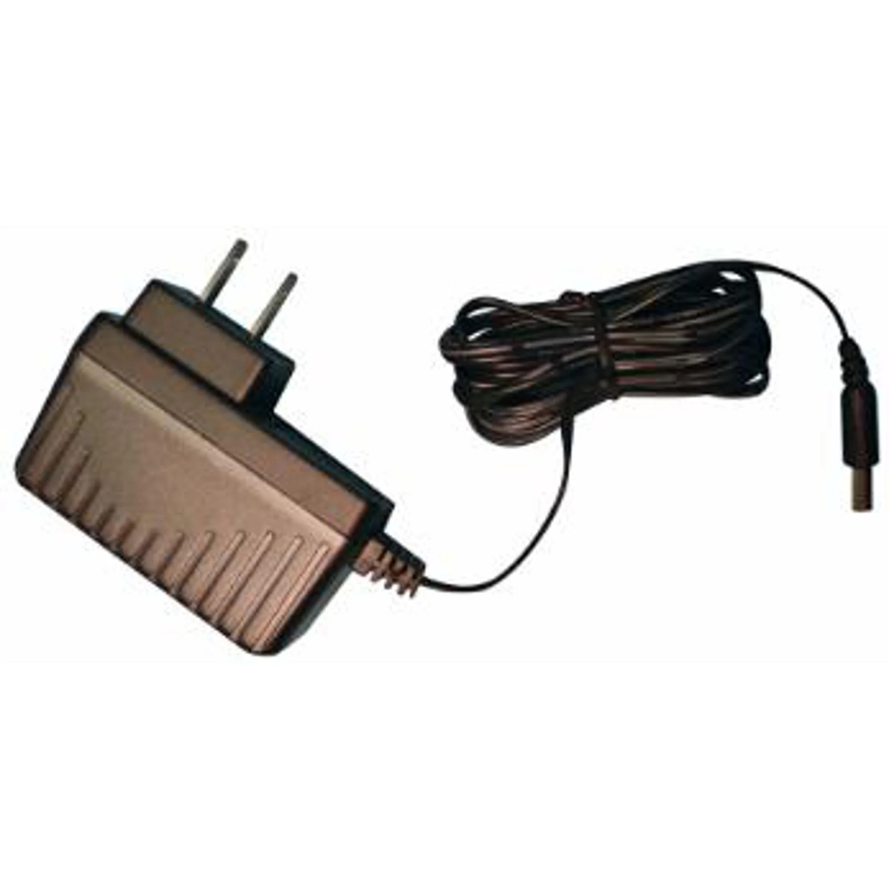
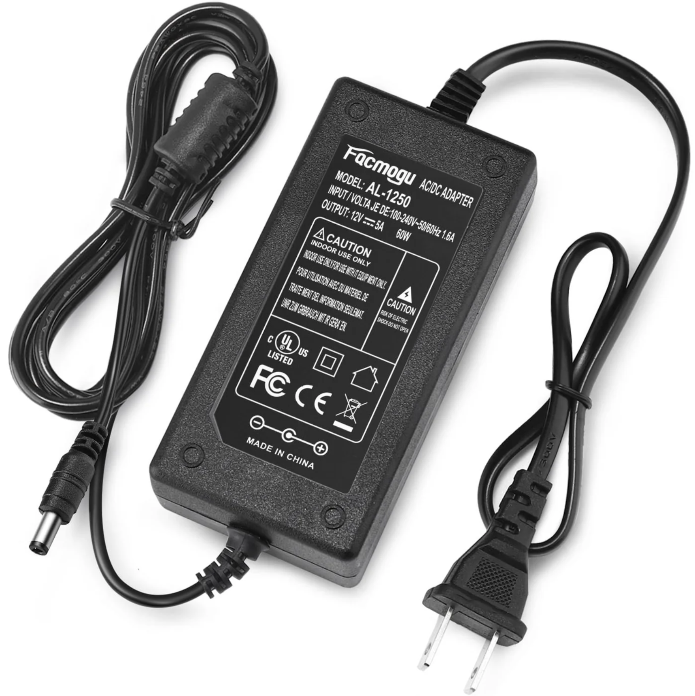

The purpose of this section is to highlight various solutions for the components used in the subsystem and identify the choices that will best suit this project.

## **MOSFETS**

### AOTF2618L

**30V • 100A • 0.0028Ω RDS(on) @ 4.5V**

* $2.00 each  
* [Datasheet](https://aosmd.com/res/data_sheets/AOTF2618L.pdf)

| Pros | Cons |
|------|------|
| Extremely low RDS(on) | Harder to source locally |
| Excellent for higher-stall motors/pumps | Typically used in SMD; TH versions rarer |
| Logic-level gate drive | May require heatsinking under high load |

---

### FQP30N06L

**60V • 32A • 0.035Ω RDS(on) @ 5V**

* $2 each  
* [Datasheet](https://www.onsemi.com/pdf/datasheet/fqp30n06l-d.pdf)

| Pros | Cons |
|------|------|
| Fully enhanced at 4.5–5V gate | Higher RDS(on) than newer FETs |
| Common, cheap, and available | TO-220 is physically large |
| Great for 9–12V motors/pumps | May need heatsink at high duty |

---

### IRLZ44N

**55V • 47A • 0.022Ω RDS(on) @ 5V**

* $4 each  
* [Datasheet](https://www.infineon.com/dgdl/irlz44n.pdf?fileId=5546d462533600a40153563b9b7a262f)

| Pros | Cons |
|------|------|
| Extremely common and proven reliable | High gate charge (needs stronger drive at high PWM) |
| Runs cool under load | Oversized for small motors |
| Great for 9V/12V inductive loads | — |

---

### STP36NF06L

**60V • 30A • 0.025Ω RDS(on) @ 5V**

* $3 each  
* [Datasheet](https://www.st.com/resource/en/datasheet/stp36nf06l.pdf)

| Pros | Cons |
|------|------|
| Automotive-grade ruggedness | Slightly more expensive |
| Very strong for inductive loads | Harder to find in hobby stores |
| Good thermals; safe for pumps/motors | — |

---

### Choice:
**Option 1: AOTF2618L**

**Reason**  
It is a class-supplied MOSFET that can perform the duties required for this project. If something were to fail during prototyping, it would be much easier to replace with minimal lead time. The cost of the component is negligible at this stage because pricing of similar MOSFETs is nearly identical. If produced on a mass scale, cost-reduction efforts would focus on optimizing price-to-performance.

---

## **Pumps**

### Adafruit 4546 (Mini Submersible Pump)

**3V • ~100mA • Low head / small flow (micro-pump class)**

* $7.95 each  
* [Product Page](https://www.adafruit.com/product/4546)

| Pros | Cons |
|------|------|
| Extremely compact | Very small flow rate |
| Easy to prototype with | Limited head pressure |
| Quiet operation | Limited head pressure |

---

### Adafruit Peristaltic Liquid Pump (ID: 1150)

**5–6V • ~500mA • ~100mL/min (≈1.6 GPH) • Peristaltic**

* $24.95 each  
* [Product Page](https://www.adafruit.com/product/3910)

| Pros | Cons |
|------|------|
| Fluid only touches tubing (sterile/clean) | Far below 30 GPH target |
| Self-priming & reversible | Expensive |
| Useful for controlled dosing | Requires adapters for 1/4" tubing |

---

### Olimex Micro Water Pump

.jpg)

**3–12V • up to 1–2 L/min (≈16–32 GPH) • ~1.5A draw**

* $3.52 each  
* [Product Page](https://www.olimex.com/Products/Components/Misc/MICRO-WATER-PUMP/)

| Pros | Cons |
|------|------|
| Capable of reaching 30 GPH target | 3mm outlet → needs 1/4" adapter |
| Works at 9V from supply | Flow drops quickly with head height |
| Extremely inexpensive | No built-in filtering |

---

### Choice:
**Option 3: Olimex Micro Water Pump**

**Reason**  
This pump provides a strong price-to-performance balance. A peristaltic pump would better meet long-term reliability and cleanliness needs, but its cost would take a significant portion of the project budget. Although the Olimex pump draws higher current, it allows the system to meet the required flow rate, reducing overall watering time.

---

## **DC Motors**

### Adafruit 2941 — DC Motor in Micro Servo Body

**4–6V • Small geared DC motor • Requires H-Bridge for forward/reverse**

* $3.50 each  
* [Product Page](https://www.adafruit.com/product/2941)

| Pros | Cons |
|------|------|
| Compact and easy to mount | Low torque |
| Runs directly from 5V rail | Requires H-bridge driver |
| Great for prototyping | Plastic gears wear over time |

---

### Adafruit 3777 — TT Gearbox Motor

**3–6V • ~160mA no-load • ~1.5A stall • ~200RPM**

* $2.95 each  
* [Product Page](https://www.adafruit.com/product/3777)

| Pros | Cons |
|------|------|
| Common and inexpensive | High stall current |
| Easy mounting | No built-in encoder |
| Great for robotics/prototyping | Plastic gearbox can wear |

---

### Pololu N20 Gearmotor (210:1 LP 6V)

**6V • ~40–70mA no-load • ~0.36–0.67A stall**

* $15 each  
* [Product Page](https://www.pololu.com/product/2206)

| Pros | Cons |
|------|------|
| Metal gearbox | Must avoid prolonged stall |
| Extremely compact | Requires coupler for shaft |
| Efficient with good torque for size | Specs vary by gear ratio |

---

### Choice:
**Option 1: Adafruit 2941 — DC Motor in Micro Servo Body**

**Reason**  
Selected for its compact servo-sized form factor, easy mounting, and compatibility with common 5V rails. It is inexpensive for prototyping and works well with H-bridge drivers (FAN8100N, L293D) for forward/reverse and PWM control. While torque is modest and gears are plastic, it meets the project’s size and simplicity requirements for light-duty actuation. Its speed is sufficient to perform both required duties.

---

## **Motor Controller for Both Motors**

### FAN8100N — Dual H-Bridge Motor Driver

**1.8–9V Motor Supply • ~3A peak/channel • Bipolar H-bridge**

* $0.96 each  
* [Datasheet](https://mm.digikey.com/Volume0/opasdata/d220001/medias/docus/1021/FAN8100N%2CMTC.pdf)

| Pros | Cons |
|------|------|
| Simple to drive from MCU | Higher voltage drop than MOSFET bridges |
| Works well for 3–6V motors | Obsolete |
| DIP package for easy prototyping | Requires heat dissipation near stall |

---

### L293D — Dual H-Bridge Motor Driver (Through-Hole)

**4.5–36V Motor Supply • 600mA per channel (1.2A peak) • Bipolar H-bridge**

* $8.73 each  
* [Datasheet](https://www.ti.com/lit/ds/symlink/l293d.pdf)

| Pros | Cons |
|------|------|
| DIP package — easy to prototype | Larger voltage drop than MOSFET bridges |
| Built-in clamp diodes | 600mA continuous limit |
| Widely available | Not ideal for low-voltage high-current stalls |

---

### L298N — Dual H-Bridge Motor Driver

**Up to 46V Motor Supply • Up to 4A combined • Bipolar H-bridge**

* $1.78 each  
* [Datasheet](https://www.st.com/resource/en/datasheet/l298.pdf)

| Pros | Cons |
|------|------|
| Very common and rugged | Large voltage drop (inefficient) |
| Easy to prototype with | Runs hot at low motor voltages |
| Good for learning setups | Physically bulky |

---

### Choice:
**Option 1: FAN8100N — Dual H-Bridge Motor Driver**

**Reason**  
This driver was chosen because it can reliably power the 3–6V DC motors being considered while supporting both forward and reverse operation through a simple input interface. It provides sufficient stall-current tolerance for motors like the TT-geared model when thermals are managed. Although it is less efficient than MOSFET-based drivers and not as widely available, its DIP package, simplicity, and compatibility with low-voltage motors make it suitable for prototyping.

---

## **Voltage Regulators**

### LM7805 Linear Regulator (TO-220)

**5V 1A Linear Voltage Regulator**

* **Typical Price:** $0.50–$1.00  
* Standard 7805 footprint (TO-220-3)

| Pros | Cons |
|------|------|
| Simple 3-pin dropout regulator (**IN–GND–OUT**) | Limited to **1A max** output |
| Very common, easy to source | Runs **very hot** at higher Vin |
| Stable and robust | Requires heatsink >500–700 mA |
| Great for small loads | Not suitable for 2–3A systems |

---

### LM1085-5.0 LDO Regulator (TO-220)

**5V 3A Low-Dropout Linear Regulator**

* **Typical Price:** $2.00–$3.50  
* TO-220-3 footprint (same as 7805)

| Pros | Cons |
|------|------|
| Up to **3A output** | High heat dissipation at high current |
| Low-dropout (~1.3V) | Requires large heatsink above ~1–2A |
| Drop-in upgrade for 7805 layouts | Must follow datasheet cap values |
| Very clean/noise-free output | Not ideal for Vin far above 5V |

---

### LM340T-5.0 Linear Regulator (TO-220)

**5V 1A General-Purpose Linear Regulator**

* **Typical Price:** $0.70–$1.50  
* TO-220-3 footprint, identical to 7805

| Pros | Cons |
|------|------|
| Very stable fixed 5V output | Limited to **1A max** |
| Same footprint and behavior as 7805 | Runs hot at higher Vin |
| Good regulation and reliability | Requires heatsink under load |
| Ideal for analog/low-noise circuits | Inefficient for motors/pumps |

---

### Choice:
**Option 2: LM1085-5.0 — 5V 3A Low-Dropout Linear Regulator**

**Reason**  
This regulator was chosen because it provides a significantly higher current capacity than the LM7805 or LM340T-5.0 while keeping the same TO-220 footprint, making it a simple drop-in upgrade for the PCB. Its 3A capability supports higher-draw subsystems such as pumps and peripherals requiring stable 5V power. Although it generates more heat under load, its improved dropout voltage and clean output make it the most effective balance of performance and compatibility.

---

## **Power Supply**

### BestCH 9V 3.0A AC Adapter

**9V 3A AC Adapter**

* $4.52 each  
* [Product Page](https://a.co/d/hFQdNi4)

| Pros | Cons |
|------|------|
| Easy to step down | Short cord |
| Built-in circuit protections | Easy to unplug |
| 100–240V AC input | — |

---

### DC 6V 3.0A AC Adapter

**6V 3A AC-to-DC Adapter**

* $6.99 each  
* [Product Page](https://shimmerandconfetti.com/products/6v-3a-adapter?variant=43920537256189&country=US&currency=USD)

| Pros | Cons |
|------|------|
| Regulated 6V output | Not suitable for 9V/12V devices |
| 100–240V AC input | Limited tip options |
| Over-current/short-circuit protection | Must verify 5.5×2.1 mm barrel polarity |

---

### FACMOGU 12V 5.0A AC Adapter (60W)

**12V 5A AC-to-DC Power Adapter**

* **$13.99 each**  
* [Product Page](https://electroeshop.com/products/facmogu-60w-12v-5a-ac-dc-power-adapter-100-240v-ac-to-dc-12v-5a-power-suppy-12-volts-5-amps-ac-dc-table-top-adapter-60-watts-12v-5a-switching-power-adaptor-converter-5-5x2-5mm-5-5x2-1mm-dc-plug?variant=42337423228964&country=US&currency=USD&utm_source=chatgpt.com)

| Pros | Cons |
|------|------|
| Strong 60W output → plenty of headroom | Larger brick-style supply |
| Supports 5.5×2.1 mm & 5.5×2.5 mm plugs | Must confirm center-positive wiring |
| 100–240V AC input | Not waterproof |
| Built-in OCP / OVP / Short-circuit protection | Cable gauge may limit long runs |

---

### Choice:
**Option 3: FACMOGU 12V 5.0A AC Adapter**

**Reason**  
The FACMOGU 12V 5.0A AC Adapter matches the system’s voltage and current requirements while remaining inexpensive and reliable. Its built-in protections and stable regulated output ensure safe, consistent operation for all subsystem components, making it the most balanced and practical choice for powering the project.
