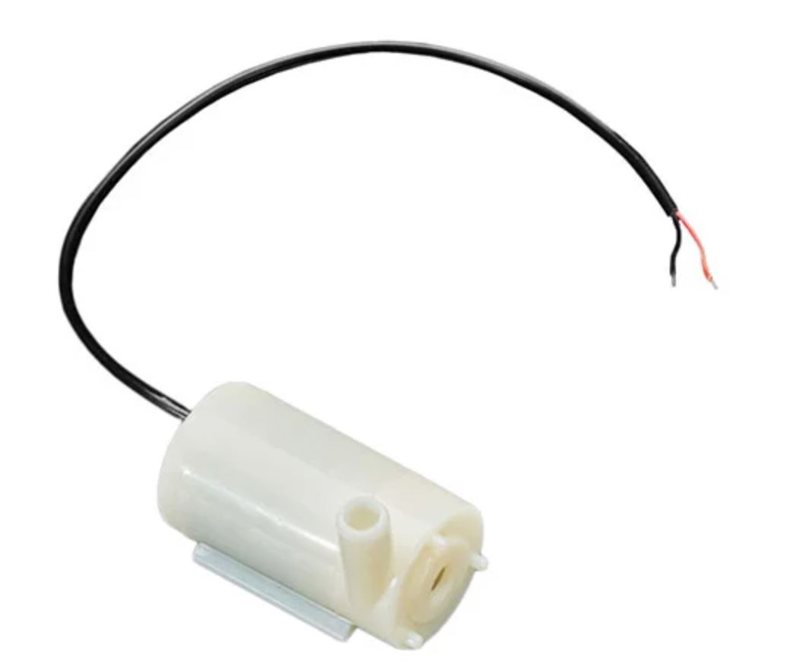
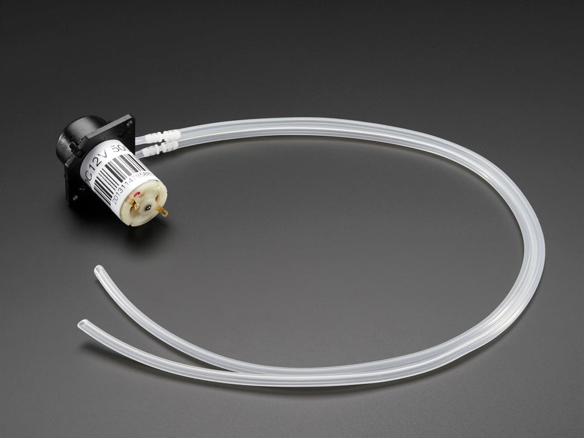

### AOTF2618L

**30V • 100A • 0.0028Ω RDS(on) @ 4.5V**

* ~ $2.00 each  
* [Datasheet](https://aosmd.com/res/data_sheets/AOTF2618L.pdf)

| Pros | Cons |
|------|------|
| Extremely low RDS(on) | Harder to source locally |
| Excellent for higher stall motors/pumps | Typically used in SMD, TH versions rarer |
| Logic-level gate drive | May require heatsinking under high load |
---

### FQP30N06L

**60V • 32A • 0.035Ω RDS(on) @ 5V**

* ~ $2 each  
* [Datasheet](https://www.onsemi.com/pdf/datasheet/fqp30n06l-d.pdf)

| Pros | Cons |
|------|------|
| Fully enhanced at 4.5–5V gate | Higher RDS(on) than newer FETs |
| Common, cheap, and available | TO-220 is large physically |
| Great for 9–12V motors/pumps | May need heatsink at high duty |
---

### IRLZ34N

**55V • 30A • 0.04Ω RDS(on) @ 5V**

* ~$2 each  
* [Datasheet](https://www.infineon.com/dgdl/irlz34n.pdf?fileId=5546d462533600a40153563b9b7ac710)

| Pros | Cons |
|------|------|
| Good balance of low RDS(on) and driveability | Not as common as IRLZ44N |
| Lower gate charge than IRLZ44N | Slightly more loss vs IRLZ44N |
| Stable switch for medium current loads | |
---

### IRLZ44N

**55V • 47A • 0.022Ω RDS(on) @ 5V**

* ~ $4 each  
* [Datasheet](https://www.infineon.com/dgdl/irlz44n.pdf?fileId=5546d462533600a40153563b9b7a262f)

| Pros | Cons |
|------|------|
| Extremely common and proven reliable | High gate charge (needs stronger drive at high PWM) |
| Runs cool under load | Oversized for tiny motors |
| Great for 9V/12V inductive loads | |
---

### RFP30N06LE

**60V • 30A • 0.047Ω RDS(on) @ 4.5V**

* ~$2.50 each  
* [Datasheet](https://mm.digikey.com/Volume0/opasdata/d220001/medias/docus/843/RFP30N06LE_RF1S30N06LESM.pdf)

| Pros | Cons |
|------|------|
| Lower dissipation at 4.5V than many older FETs | Less stocked than IRL series |
| Fully logic-level compatible | Slightly higher RDS(on) than IRLZ44N |
| Easy alternative to FQP30N06L | |
---

### STP36NF06L

**60V • 30A • 0.025Ω RDS(on) @ 5V**

* ~ $3 each  
* [Datasheet](https://www.st.com/resource/en/datasheet/stp36nf06l.pdf)

| Pros | Cons |
|------|------|
| Automotive-grade ruggedness | Slightly more expensive |
| Very strong for inductive loads | Harder to find in hobby stores |
| Good thermals, safe for pumps/motors | |
---

### Choice:
Option 1: AOFT2618L
# Reason:
It is a class-supplied MOSFET that can perform the duties required for this project. If something were to fail during prototyping, it would be much easier to replace with minimal lead time. The cost of the component is negligible at this stage because the pricing of similar components is nearly identical. If produced on a mass scale, cost reduction efforts would focus on optimizing price-to-performance.

### Pumps
### Adafruit 4546 (Mini Submersible Pump)

**3V • ~100mA • Low head / small flow (micro-pump class)**

* ~\$7.95 each  
* [Product Page](https://www.adafruit.com/product/4546)

| Pros | Cons |
|------|------|
| Extremely compact | Very small flow rate |
| Easy to prototype with | Limited head pressure|
| Quiet operation | Limited head pressure |
---

### Adafruit Peristaltic Liquid Pump (ID: 1150)

**5–6V • ~500mA • ~100mL/min (≈1.6 GPH) • Peristaltic**

* ~\$24.95 each  
* [Product Page](https://www.adafruit.com/product/3910)

| Pros | Cons |
|------|------|
| Fluid only touches tubing (sterile / clean) | Far below 30 GPH target |
| Self-priming & reversible | Expensive |
| Would be fun to use | Requires narrow tubing; adapters for 1/4" needed |
---

### Olimex Micro Water Pump

.jpg)

**3–12V • up to 1–2 L/min (≈16–32 GPH) • ~1.5A draw**

* ~\$3.52 each  
* [Product Page](https://www.olimex.com/Products/Components/Misc/MICRO-WATER-PUMP/)

| Pros | Cons |
|------|------|
| Capable of reaching 30 GPH target | 3mm outlet → needs adapter for 1/4" tubing |
| Works at 9V from supply | Flow drops quickly with head |
| Extremely inexpensive | No built-in filtering |
---

### Choice:
Option 1: Olimex Micro Water Pump
# Reason:
This pump provides a good price-to-performance balance. A peristaltic pump would likely better fit our needs, but its cost would take a significant portion of our budget and is not feasible. The higher flow rate comes at the cost of a higher current draw, but it will allow the pump to run for a shorter amount of time per watering. 
