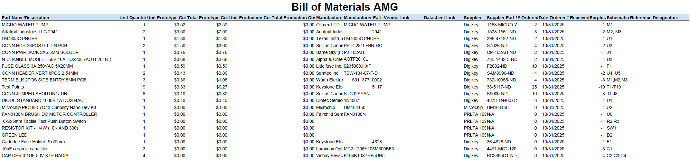

## Overview
Listed below are the materials used throughout the project. The system includes three motors controlled by MOSFETs or H-bridge drivers, along with necessary protection components such as fuses, resistors, capacitors, and voltage regulators. Additionally, test points and jumpers are incorporated to facilitate debugging and performance verification.

## Bill of Materials 
{style width: "2000"}

The BOM as a PDF download is available [*here*](Bill of Materials 30OCT2025.pdf)