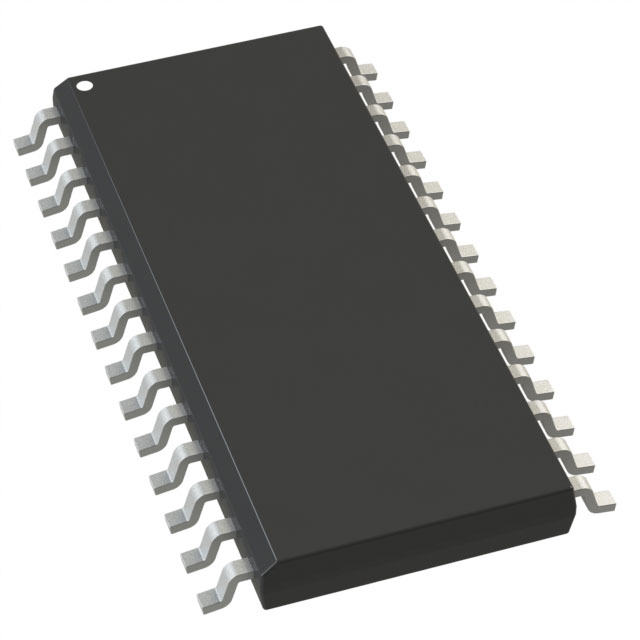

## My Role & Responsibilities

I am responsible for the Camera Actuation subsystem. This subsystem controls two stepper motor drivers to rotate a low-weight camera and uses a Hall effect sensor to establish a repeatable “home” position reference. The microcontroller generates STEP and DIR pulse signals (and enable control) for each motor driver, reads the Hall sensor as a digital interrupt input for homing, and communicates with the Control subsystem through a UART RX/TX link. The subsystem uses a 12V motor power rail for the stepper drivers/motors and a regulated 3.3V rail for the microcontroller and logic signals. The design prioritizes clean power distribution, grounding, and debouncing/filtering to prevent motor noise from causing resets or false home triggers.

---

## Module's Selected Major Components

## Power Management

### AP63203WU-7

* **Package:** TSOT-23-6  
* **Output:** Fixed 3.3V  
* **Max Current:** 2A  
* **Input Range:** 3.8V – 32V  
* **Approx. Price:** ~$0.50–$0.80  
* [**Product Page**](https://www.digikey.com/en/products/detail/diodes-incorporated/AP63203WU-7/9858426?s=N4IgTCBcDaIIIAUBsBmMAGFB1AqgWgHYQBdAXyA)

| Pros | Cons |
|------|------|
| High output current (2A) | Requires careful PCB layout |
| Wide input range (good for 12V systems) | Needs external inductor and capacitors |
| High efficiency | Small package harder to solder |
| Well-documented | |

---

### RT8008-33GB

* **Package:** SOT-23-5  
* **Output:** Fixed 3.3V  
* **Max Current:** ~600mA  
* **Input Range:** Up to ~23V  
* **Approx. Price:** ~$1.30–$1.50  
* [**Product Page**](https://www.digikey.com/en/products/detail/richtek-usa-inc/RT8008-33GB/2545904?s=N4IgTCBcDaIEoBUAcAGFSC0BmLBxAQiALoC%2BQA)

| Pros | Cons |
|------|------|
| Very small footprint | Lower max current |
| Fixed 3.3V simplifies design | Not ideal for ESP32 + expansion |
| Fewer pins | Narrower input range |

---

### MP2451DT-LF-Z (Fixed 3.3V Variant)

* **Package:** TSOT-23-6  
* **Output:** Fixed 3.3V  
* **Max Current:** 1A  
* **Input Range:** Up to 36V  
* **Approx. Price:** ~$2.00–$2.50  
* [**Product Page**](https://www.digikey.com/en/products/detail/monolithic-power-systems-inc/MP2451DT-LF-Z/5292058?s=N4IgTCBcDaILIAUwBYCsBGAIgFQLQBkAxXALRAF0BfIA)

| Pros | Cons |
|------|------|
| Handles higher input voltage | More expensive |
| Good efficiency | Lower current than AP63203 |
| Compact package | Requires careful layout |

**Choice:**  
The AP63203 was selected because it provides enough current headroom for possible expansion or future design changes. It also offers relatively low EMI performance compared to many low-cost buck regulators, helping prevent signal integrity issues and noise coupling when designing the PCB for mixed motor and logic systems.

---

## Sensor

### Allegro A1324 (SOT-23W Linear Hall Sensor)

* **Manufacturer:** Allegro MicroSystems  
* **Type:** Linear Analog Hall Sensor  
* **Operating Voltage:** 3.0V – 5.5V  
* **Package:** SOT-23W  
* **Approx. Price:** ~$1.00–$1.50  
* [**Product Page**](https://www.digikey.com/en/products/detail/allegro-microsystems/A1324LLHLX-T/2728143)

| Pros | Cons |
|------|------|
| Analog output allows measurable value | Requires ADC |
| Enables firmware thresholding | Requires calibration |
| Compact SMD footprint | Slight firmware complexity |

---

### TI DRV5053 (Selected)

* **Manufacturer:** Texas Instruments  
* **Type:** Linear Analog Hall Sensor  
* **Operating Voltage:** 2.7V – 6.0V  
* **Package:** SOT-23 / SON  
* **Approx. Price:** ~$1.50–$2.50  
* [**Product Page**](https://www.digikey.com/en/products/detail/texas-instruments/DRV5053VAQDBZR/5015738)

| Pros | Cons |
|------|------|
| Clean analog output | Requires ADC |
| Stable and noise resistant | Slightly higher cost |
| 3.3V compatible | |

---

### Diodes Inc. AH337

* **Manufacturer:** Diodes Incorporated  
* **Type:** Linear Analog Hall Sensor  
* **Operating Voltage:** 3.0V – 5.5V  
* **Package:** SOT-23  
* **Approx. Price:** ~$0.80–$1.30  
* [**Product Page**](https://www.digikey.com/en/products/detail/diodes-incorporated/AH3373-SA-7/6124926)

| Pros | Cons |
|------|------|
| Low cost | Requires ADC |
| Small footprint | Needs thresholding |
| Easy PCB integration | Mid-rail interpretation needed |

**Selection Rationale:**  
The TI DRV5053 was selected as the analog Hall sensor option for repeatable home position detection during camera sweep startup. Its linear analog output provides a measurable voltage proportional to magnetic field strength, allowing the ESP32 to determine the home threshold using the ADC. This enables more precise positioning compared to a digital switch by allowing firmware-based filtering, hysteresis, and calibration for consistent repeatability.

---

## Actuator

### 28BYJ-48 High Quality Stepper Motor

* **Type:** 4-phase unipolar  
* **Operating Voltage:** 12 V  
* **Rated Current:** ~50 mA/phase  
* **Step Angle:** 5.625°/64  
* **Approx. Price:** ~$1–$2  
* [**Product Page**](https://www.digikey.com/en/products/detail/mikroelektronika/MIKROE-1530/5724295)

| Pros | Cons |
|------|------|
| Very low current | Lower precision |
| Inexpensive | Plastic gears |

---

### Stepperonline NEMA 14 Bipolar Motor (Selected)

* **Type:** NEMA 14 bipolar  
* **Step Angle:** 1.8°  
* **Rated Current:** ~0.4 A/phase  
* **Operating Voltage:** 12 V  
* **Approx. Price:** ~$9–$20  
* [**Product Page**](https://www.digikey.com/en/products/detail/pololu/1208/10449951?s=N4IgjCBcpgLFoDGUBmBDANgZwKYBoQB7KAbRAHZYA2K8kAXQIAcAXKEAZRYCcBLAOwDmIAL4EwATlgAGBCGSR02fEVLh4jEK3YA5AK4BbHH2QizQA)

| Pros | Cons |
|------|------|
| Moderate torque | Larger footprint |
| Precision stepping | Requires driver tuning |

---

### NEMA-17 Size Stepper Motor

* **Type:** Bipolar  
* **Step Angle:** 1.8°  
* **Rated Current:** ~0.35 A/phase  
* **Operating Voltage:** 12 V  
* **Approx. Price:** ~$13–$15  
* [**Product Page**](https://www.digikey.com/en/products/detail/adafruit-industries-llc/324/5022791)

| Pros | Cons |
|------|------|
| Higher torque | Larger size |
| Smooth motion | More than needed |

**Selection Rationale:**  
The NEMA 14 bipolar stepper offers higher precision and smoother motion than small geared motors while keeping current modest enough for efficient 12 V drivers. Its 1.8° step angle provides fine resolution, and its compact frame fits well within a lightweight camera actuation subsystem. This makes it an ideal balance between size, precision, and power consumption.

---

## Stepper Driver Selection

### DRV8825

* **Operating Voltage:** 8.2V – 45V  
* **Max Current:** ~2.2A/phase  
* **Microstepping:** Up to 1/32  
* **Approx. Price:** ~$3–$5  
* [**Product Page**](https://www.digikey.com/en/products/detail/texas-instruments/DRV8825PWPR/2695909)

| Pros | Cons |
|------|------|
| Works natively at 12V | Requires current adjustment |
| High headroom | Larger module footprint |
| Reliable and documented | |

---

### DRV8834

* **Operating Voltage:** 2.5V – 10.8V  
* **Max Current:** ~1.5A/phase  
* **Microstepping:** Up to 1/32  
* **Approx. Price:** ~$5–$8  
* [**Product Page**](https://www.digikey.com/en/products/detail/texas-instruments/DRV8834PWPR/3182055)

| Pros | Cons |
|------|------|
| Compact SMD | Slightly low voltage rating |
| Good for integration | Layout complexity |

---

### TMC2209

* **Operating Voltage:** 4.75V – 36V  
* **Max Current:** ~1.2A RMS  
* **Microstepping:** Up to 1/256  
* **Approx. Price:** ~$6–$10  
* [**Product Page**](https://www.digikey.com/en/products/detail/analog-devices-inc-maxim-integrated/TMC2209-LA-T/10232491)

| Pros | Cons |
|------|------|
| Very smooth/quiet | Higher cost |
| Excellent current control | More complex configuration |

**Selection Rationale:**  
The DRV8825 is a robust and widely used bipolar stepper driver well suited for the selected NEMA 14 motor (~0.4 A/phase). Its wide voltage range makes it ideal for a 12 V system, and its built-in current limiting ensures safe motor operation. Microstepping support allows smooth camera sweep motion. Due to its reliability, strong documentation base, and ease of integration with STEP/DIR control from the ESP32, it represents a low-risk and well-supported solution for this subsystem.

---

