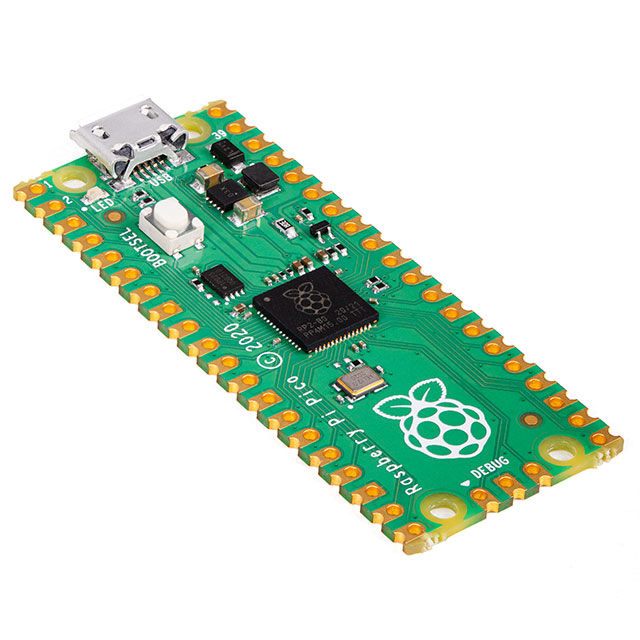

## Microcontroller Selection Justification

The ESP32-S3-WROOM-1-N4 was selected for the Camera Actuation subsystem because it meets all functional requirements while providing additional design margin and flexibility. The subsystem requires approximately 10–12 GPIO pins to support two stepper motor drivers (STEP, DIR, and EN signals), a Hall-effect sensor for home position detection, and a UART interface for communication with the Control subsystem. The ESP32-S3 provides sufficient GPIO, hardware UART support, interrupt-capable inputs for the Hall sensor, and timing peripherals capable of generating accurate step pulses for motor control.

Although wireless communication is not required, the inclusion of Wi-Fi and Bluetooth does not negatively impact system performance and allows for potential future expansion. The module operates at 3.3V, which matches the regulated logic rail of the subsystem, and its surface-mount castellated package is well suited for PCB integration. By avoiding strapping pins during GPIO allocation, reliable boot behavior can be maintained. Overall, the ESP32-S3-WROOM-1-N4 satisfies all subsystem requirements and provides a reliable, low-risk solution for motor control, sensing, and communication tasks.

---

### ESP32-S3-WROOM-1-N4

* **Manufacturer:** Espressif  
* **Core:** Dual-core Xtensa LX7  
* **Flash:** 4MB (N4 variant)  
* **Operating Voltage:** 3.3V  
* **GPIO:** Up to 45 programmable GPIO  
* **Wireless:** Wi-Fi + BLE (not required but available)  
* **Package:** SMD Module (castellated edges)  
* **Approx. Price:** $5 
* [**Product Page**](https://www.digikey.com/en/products/detail/espressif-systems/ESP32-S3-WROOM-1-N4/16162639)

| Pros | Cons |
|------|------|
| Dual-core processor provides strong performance for motor control and sensor handling | Includes wireless hardware that is not required for this subsystem |
| Large GPIO count for stepper drivers, hall sensor, and debugging | Slightly higher cost than minimal MCUs |
| Mature ESP-IDF and Arduino ecosystem support | Higher power consumption than basic MCUs |
| Integrated USB support for easier programming/debugging | |
| Ample memory (4MB flash) for future expandability | |

---

### Raspberry Pi Pico W (Wireless Disabled)

* **Manufacturer:** Raspberry Pi  
* **Core:** Dual-core ARM Cortex-M0+ @ 133 MHz  
* **Flash:** 2 MB (on-board QSPI)  
* **Operating Voltage:** 3.3V  
* **GPIO:** ~26 usable GPIO  
* **Wireless:** Present but can be disabled  
* **Package:** SMD Module or small board  
* **Approx. Price:** $5 
* [**Product Page**](https://www.digikey.com/en/products/detail/raspberry-pi/SC0915/13624793)

| Pros | Cons |
|------|------|
| Very low cost | Fewer hardware peripherals compared to ESP32 |
| Strong support and examples for PWM / control | No native Wi-Fi/BLE if wireless is disabled |
| Dual cores suitable for motion control tasks | Less flash and SRAM than ESP32 |
| Extensive community support | Limited ADC resolution vs some MCUs |

---

### STM32G071RB (STM32G0 Series MCU)

* **Manufacturer:** STMicroelectronics  
* **Core:** ARM Cortex-M0+ @ 64 MHz  
* **Flash:** 128 KB  
* **Operating Voltage:** 1.8V – 3.6V  
* **GPIO:** Up to ~51 GPIO  
* **Wireless:** None  
* **Package:** LQFP or UFBGA  
* **Approx. Price:** $3  
* [**Product Page**](https://www.digikey.com/en/products/detail/stmicroelectronics/STM32G071RBT6/9749146)
| Pros | Cons |
|------|------|
| Good PWM and timer hardware for precise stepper control | Requires external debugger (e.g., ST-Link) |
| Excellent power efficiency | MCU ecosystem differs from ESP32 |
| No wireless hardware overhead | Less RAM than ESP32 |
| Many GPIO and peripheral options | Flash size smaller |

---

## Microcontroller Resource Check (Candidate: ESP32-S3-WROOM-1-N4)

| Resource / Feature | Needed? | ESP32-S3 Provides | Meets Need? | Notes |
|--------------------|--------:|-------------------|:-----------:|-------|
| Total usable GPIO | ~12–15 | Many GPIO available | ✅ | Enough for 2 drivers + hall + UART + debug |
| UART interfaces | 1 | Supported | ✅ | Reserve one for team communication |
| I2C interfaces | 0–1 | Supported | ✅ | Optional expansion |
| SPI interfaces | 0 | Supported | ✅ | Only needed if SPI drivers used |
| Interrupt-capable GPIO | 1 | Supported | ✅ | Hall sensor input |
| ADC | Optional | Available | ✅ | Required for analog Hall |
| 3.3V operation | Yes | Native | ✅ | Supplied from buck |
| Boot/strapping pins | Must avoid conflicts | GPIO0, GPIO45, etc. | ⚠️ | Avoid for STEP/HOME |
| Programming/Debug | Yes | Supported | ✅ | Provide reset/boot access |

## ESP32-S3-WROOM-1 Pin Definitions

| Name | No. | Type | Function |
|------|-----|------|----------|
| GND | 1 | P | Ground |
| 3V3 | 2 | P | Power supply |
| EN | 3 | I | High: on (enables chip). Low: off (powers off). Do not leave floating. |
| IO4 | 4 | I/O/T | RTC_GPIO4, GPIO4, TOUCH4, ADC1_CH3 |
| IO5 | 5 | I/O/T | RTC_GPIO5, GPIO5, TOUCH5, ADC1_CH4 |
| IO6 | 6 | I/O/T | RTC_GPIO6, GPIO6, TOUCH6, ADC1_CH5 |
| IO7 | 7 | I/O/T | RTC_GPIO7, GPIO7, TOUCH7, ADC1_CH6 |
| IO15 | 8 | I/O/T | RTC_GPIO15, GPIO15, U0RTS, ADC2_CH4, XTAL_32K_P |
| IO16 | 9 | I/O/T | RTC_GPIO16, GPIO16, U0CTS, ADC2_CH5, XTAL_32K_N |
| IO17 | 10 | I/O/T | RTC_GPIO17, GPIO17, U1TXD, ADC2_CH6 |
| IO18 | 11 | I/O/T | RTC_GPIO18, GPIO18, U1RXD, ADC2_CH7, CLK_OUT3 |
| IO8 | 12 | I/O/T | RTC_GPIO8, GPIO8, TOUCH8, ADC1_CH7, SUBSPICS1 |
| IO19 | 13 | I/O/T | RTC_GPIO19, GPIO19, U1RTS, ADC2_CH8, CLK_OUT2, USB_D- |
| IO20 | 14 | I/O/T | RTC_GPIO20, GPIO20, U1CTS, ADC2_CH9, CLK_OUT1, USB_D+ |
| IO3 | 15 | I/O/T | RTC_GPIO3, GPIO3, TOUCH3, ADC1_CH2 |
| IO46 | 16 | I/O/T | GPIO46 |
| IO9 | 17 | I/O/T | RTC_GPIO9, GPIO9, TOUCH9, ADC1_CH8, FSPIHD, SUBSPIHD |
| IO10 | 18 | I/O/T | RTC_GPIO10, GPIO10, TOUCH10, ADC1_CH9, FSPICS0, FSPIIO4, SUBSPICS0 |
| IO11 | 19 | I/O/T | RTC_GPIO11, GPIO11, TOUCH11, ADC2_CH0, FSPID, FSPIIO5, SUBSPID |
| IO12 | 20 | I/O/T | RTC_GPIO12, GPIO12, TOUCH12, ADC2_CH1, FSPICLK, FSPIIO6, SUBSPICLK |
| IO13 | 21 | I/O/T | RTC_GPIO13, GPIO13, TOUCH13, ADC2_CH2, FSPIQ, FSPIIO7, SUBSPIQ |
| IO14 | 22 | I/O/T | RTC_GPIO14, GPIO14, TOUCH14, ADC2_CH3, FSPIWP, FSPIDQS, SUBSPIWP |
| IO21 | 23 | I/O/T | RTC_GPIO21, GPIO21 |
| IO47 | 24 | I/O/T | SPICLK_P_DIFF, GPIO47, SUBSPICLK_P_DIFF |
| IO48 | 25 | I/O/T | SPICLK_N_DIFF, GPIO48, SUBSPICLK_N_DIFF |
| IO45 | 26 | I/O/T | GPIO45 |
| IO0 | 27 | I/O/T | RTC_GPIO0, GPIO0 |
| IO35 | 28 | I/O/T | SPIIO6, GPIO35, FSPID, SUBSPID |
| IO36 | 29 | I/O/T | SPIIO7, GPIO36, FSPICLK, SUBSPICLK |
| IO37 | 30 | I/O/T | SPIDQS, GPIO37, FSPIQ, SUBSPIQ |
| IO38 | 31 | I/O/T | GPIO38, FSPIWP, SUBSPIWP |
| IO39 | 32 | I/O/T | MTCK, GPIO39, CLK_OUT3, SUBSPICS1 |
| IO40 | 33 | I/O/T | MTDO, GPIO40, CLK_OUT2 |
| IO41 | 34 | I/O/T | MTDI, GPIO41, CLK_OUT1 |
| IO42 | 35 | I/O/T | MTMS, GPIO42 |
| RXD0 | 36 | I/O/T | U0RXD, GPIO44, CLK_OUT2 |
| TXD0 | 37 | I/O/T | U0TXD, GPIO43, CLK_OUT1 |
| IO2 | 38 | I/O/T | RTC_GPIO2, GPIO2, TOUCH2, ADC1_CH1 |
| IO1 | 39 | I/O/T | RTC_GPIO1, GPIO1, TOUCH1, ADC1_CH0 |
| GND | 40 | P | Ground |
| EPAD | 41 | P | Ground (Exposed Pad) |

---

## ESP32-S3 Pin Allocation

| Peripheral | Signal | GPIO | Notes |
|------------|--------|------|-------|
| UART to Control | TX | GPIO__ |  |
| UART to Control | RX | GPIO__ |  |
| Stepper Driver #1 | STEP | GPIO__ | Pulse output |
| Stepper Driver #1 | DIR | GPIO__ | Direction |
| Stepper Driver #1 | EN | GPIO__ | Enable |
| Stepper Driver #2 | STEP | GPIO__ | Pulse output |
| Stepper Driver #2 | DIR | GPIO__ | Direction |
| Stepper Driver #2 | EN | GPIO__ | Enable |
| Hall Sensor | HOME | GPIO__ | Interrupt input + debounce/filter |
| Debug | LED | GPIO__ | Optional |
| Debug | Button | GPIO__ | Optional |

---

