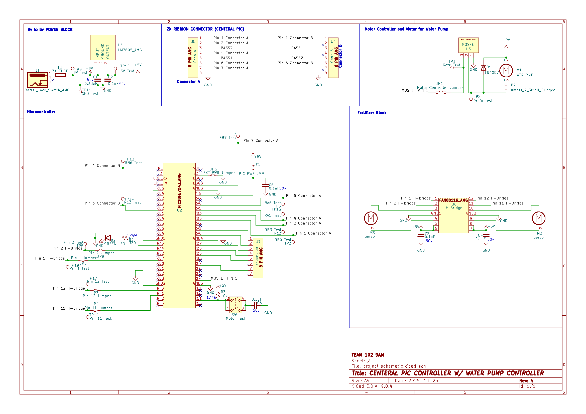
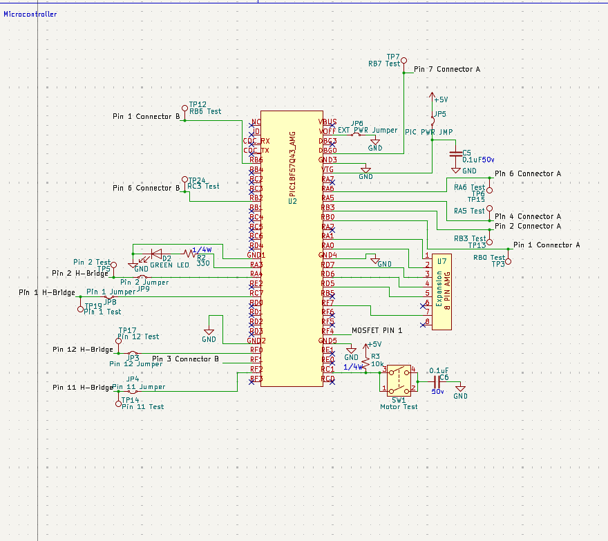
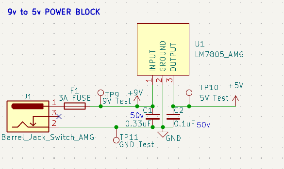
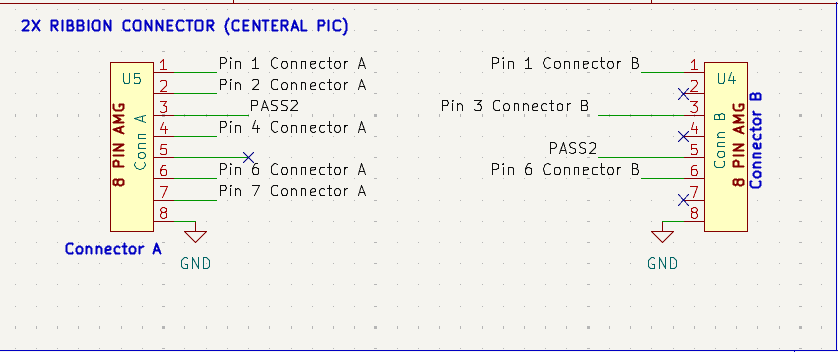

## Overview

This schematic is design to support a motor driven water pump to send water to plants down a common rail. This is powered by a 9v 3A power supply that is split to 5v 1.5A to the microcontroller, and 9v 3A into the motor controlled by a mosfet.

{style width:"350" height:"300;"}
**Figure 1:** Full Scematic

{style width:"350" height:"300;"}
**Figure 2:** Microcontroller and Motor 

{style width:"350" height:"300;"}
**Figure 3:** Power Block 

{style width:"350" height:"300;"}
**Figure 4:** Ribbon Cable

.png){style width:"350" height:"300;"}
**Figure 5:** Fertilizer Motors

.png){style width:"350" height:"300;"}
**Figure 6:** Water Pump

## Resouces

The schematic as a PDF download is available [*here*](finalSchematicREV.pdf) and ZIP file [*here*](v2.zip)