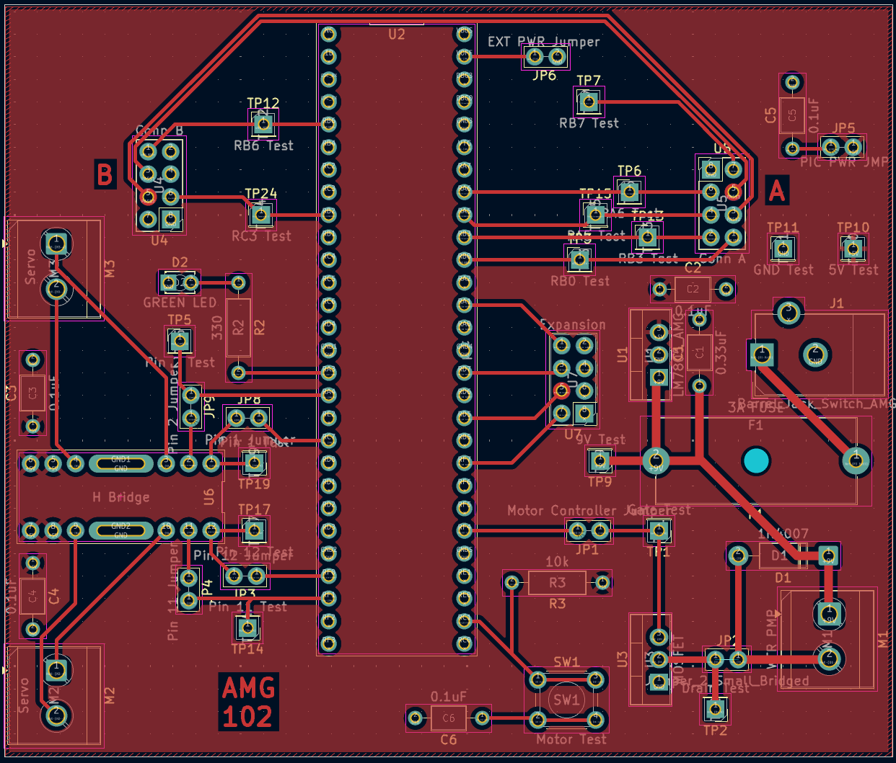
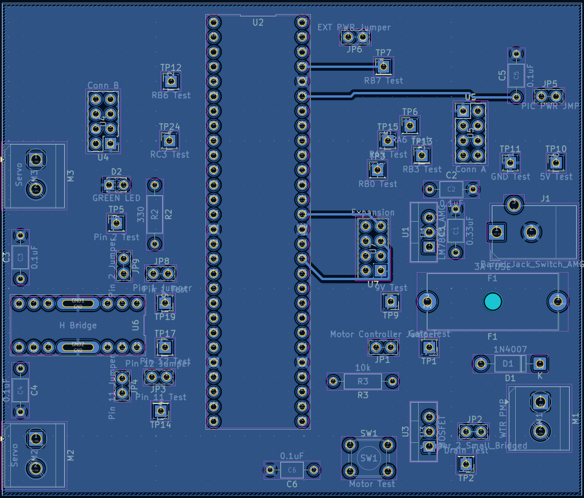

## Overview

This PCB is designed to support a motor driven water pump to send water to plants down a common rail and to introduce fertilizer to the system . This is powered by a 9v 3A power supply that is split to 5v 1.5A to the microcontroller, and 9v 3A into the motor controlled by a mosfet.

{style width:"350" height:"300;"}
**Figure 1:** Front Copper

{style width:"350" height:"300;"}
**Figure 2:** Back Copper

## Resouces

The PCB as a PDF download is available [*here*](PCB_PDF.pdf) and a Gerber ZIP file [*here*](AustinGonzalez102.zip)