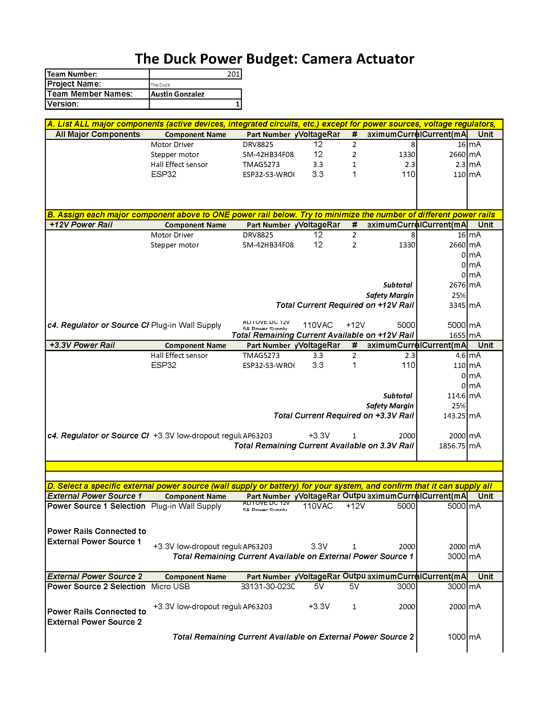

## Power System Overview

With multiple motors being used in this subsystem, it was important to understand the possible loads the system could experience. I calculated the expected load by taking the stall current of the two stepper motors and adding the highest typical current draw of the other critical components. Using this information, I added a safety margin of **25%** and determined that the maximum possible load would be approximately **3500 mA**.

Based on this calculation, I decided to use a **12 V, 5000 mA wall power supply** along with a compatible **barrel jack connector** to ensure the system can reliably meet its power requirements. This also leaves enough headroom for potential future component upgrades or additional load.

Although the system is designed to connect to the **shared team power system or USB power**, those sources are not capable of supplying the current required to operate the stepper motor subsystem. When powered from shared team power or USB, the **motor functionality is disabled**, but the microcontroller and low-power components can still operate for debugging and communication purposes.

### Power Rails

There are **two separate power levels** on this board:

- **12 V Rail** – Used by the stepper motor drivers to power the stepper motors.
- **3.3 V Rail** – Used to power the microcontroller, hall effect sensor, and all debugging-related peripherals.

### 3.3V Regulation

The **3.3 V rail** is generated using an **AP63203 buck converter**, which provides a clean and regulated **3.3 V supply capable of delivering up to 2000 mA**.

The Power Budget as a xlsx file can be downloaded [*here*](Power Budget EGR314.xlsx).