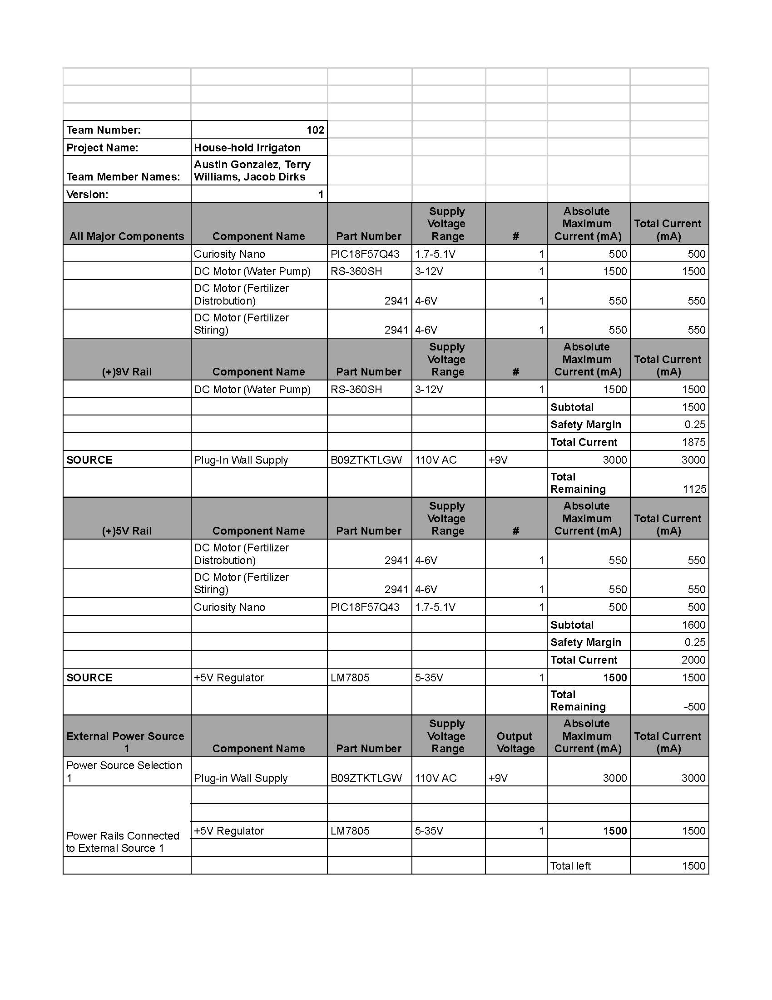

## Overview
## Overview
After selecting components in [Component Selection](https://austingonzalez-egr304.github.io/02-Component-Selection/Component-Selection/) we needed to ensure that the subsection would have the power it needs with the added requirement of a safety margin. Therefore, we took the active components, meaning we excluded switches and passive components, and ensured our power supply as well as our regulators were able to get the power needed. The specifications for each piece came from their datasheet except in the case of the motor where it will only get power through the motor driver so it has different tolerances.

{style width:"350" height:"300;"}

## Conclusions

From the prepare Power Budget, I found that I do not have enough power to run all components at once via the 9V 3A barrel jack. This however shouldnt cause any issues for my component since the the large power draws in the system wont run at the same time.

## Resouces

The power budget as a PDF download is available [*here*](Power Budget T102 EGR 304 - Sheet1.pdf), and a Microsoft Excel Sheet [*here*](Power Budget T102 EGR 304.xlsx).