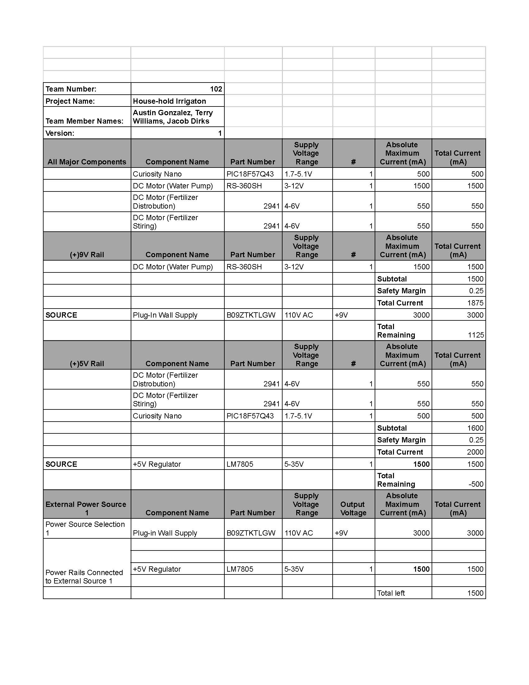

## Overview
## Overview
After selecting components in [Component Selection](https://austingonzalez-egr304.github.io/02-Component-Selection/Component-Selection/) we needed to ensure that the subsection would have the power it needs with the added requirement of a safety margin. Therefore, we took the active components, meaning we excluded switches and passive components, and ensured our power supply as well as our regulators were able to get the power needed. The specifications for each piece came from their datasheet except in the case of the motor where it will only get power through the motor driver so it has different tolerances.

{style width:"350" height:"300;"}

## Conclusions

From the prepared Power Budget, it was determined that the total current draw of all components would exceed the 9 V 3 A barrel-jack supply if all loads operated simultaneously. However, this estimate uses stall current values for the motors, which represent worst-case startup conditions. In practice, the motors will not all start or run at the same time, and the control logic limits concurrent operation of high-current devices (motors). As a result, the maximum expected operating current remains within the power supply’s rated capability.

## Resouces

The power budget as a PDF download is available [*here*](Power Budget T102 EGR 304 - Sheet1.pdf), and a Microsoft Excel Sheet [*here*](Power Budget T102 EGR 304.xlsx).