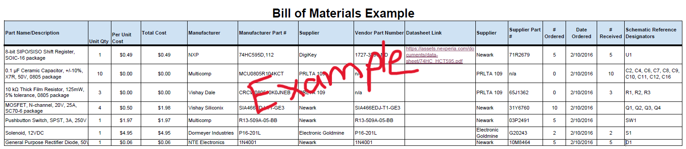

| **Part Name/Description**              | **Qty** | **Unit Cost** | **Total Cost** | **Manufacture**   | **Manufacturer #**  | **Vendor Link** | **Datasheet Link** | **Schematic Reference Designators**                |
| :------------------------------------- | :------ | :------------ | :------------- | :---------------- | :------------------ | :-------------- | :----------------- | :------------------------------------------------- |
| 100µF 6.3V X5R Ceramic Capacitor, 1206 | 4       | $0.55         | $2.20          | Murata            | GMC31X5R107K6R3NT   | DigiKey         | TBD                | C8, C10                                            |
| 0.01µF 500V C0G Capacitor, 1206        | 5       | $0.45         | $2.25          | TDK               | CHV1206N500103JCT   | DigiKey         | TBD                | C5, C15                                            |
| 22µF 25V X5R Capacitor, 1206           | 5       | $0.09         | $0.45          | Taiyo Yuden       | TMK316BBJ226ML-T    | DigiKey         | TBD                | C3, C4                                             |
| 0.1µF 50V X7R Capacitor, 1206          | 20      | $0.012        | $0.24          | KEMET             | C1206C104K5RACTU    | DigiKey         | TBD                | C6, C7, C9, C12, C13, C14, C17, C18, C19, C20, C21 |
| 10µF 25V X5R Capacitor, 1206           | 10      | $0.042        | $0.42          | Taiyo Yuden       | TMK316BJ106KL-T     | DigiKey         | TBD                | C1                                                 |
| 0.47µF 100V Capacitor, 1206            | 10      | $0.259        | $2.59          | TDK               | C3216X7R2A474K160AA | DigiKey         | TBD                | C11, C16                                           |
| Red LED 1206                           | 10      | $0.096        | $0.96          | Lite-On           | LTST-C150EKT        | DigiKey         | TBD                | D1                                                 |
| Green LED 1206                         | 10      | $0.099        | $0.99          | Lite-On           | LTST-C150GKT        | DigiKey         | TBD                | —                                                  |
| Blue LED 1206                          | 10      | $0.159        | $1.59          | Lite-On           | LTST-C150TBKT       | DigiKey         | TBD                | D2, D3                                             |
| Schottky Diode 40V 1A                  | 4       | $0.35         | $1.40          | Vishay            | SD1206S040S1R0      | DigiKey         | TBD                | D4                                                 |
| 3.9µH Inductor 1206                    | 10      | $0.087        | $0.87          | Coilcraft         | MCLA3216V1-3R9-R    | DigiKey         | TBD                | L1                                                 |
| 1MΩ Resistor 0.1% 1206                 | 10      | $0.138        | $1.38          | Yageo             | RT1206BRD071ML      | DigiKey         | TBD                | R1, R8                                             |
| 10kΩ Resistor 1206                     | 125     | $0.008        | $1.00          | Stackpole         | RMCF1206FT10K0      | DigiKey         | TBD                | R2, R7, R13, R14, R17, R18                         |
| 0.2Ω Current Sense Resistor            | 10      | $0.101        | $1.01          | Bourns            | CRL1206-FW-R200ELF  | DigiKey         | TBD                | R3, R4, R10, R11                                   |
| 50kΩ Resistor                          | 5       | $0.22         | $1.10          | Yageo             | RT1206BRE0750KL     | DigiKey         | TBD                | R5, R12                                            |
| 30kΩ Resistor                          | 85      | $0.0116       | $0.99          | Yageo             | RC1206FR-0730KL     | DigiKey         | TBD                | R6, R9                                             |
| 4.7kΩ Resistor                         | 100     | $0.0095       | $0.95          | Stackpole         | RMCF1206FT4K70      | DigiKey         | TBD                | R15, R16, R22, R23, R24                            |
| 220Ω Resistor                          | 100     | $0.0081       | $0.81          | Stackpole         | RMCF1206FT220R      | DigiKey         | TBD                | R19, R20, R21                                      |
| Tactile Push Button Switch             | 5       | $0.74         | $3.70          | C&K               | KSC621J LFS         | DigiKey         | TBD                | SW1, SW2, SW3                                      |
| 3.3V Buck Regulator                    | 5       | $0.71         | $3.55          | Diodes Inc.       | AP63203WU-7         | DigiKey         | Datasheet          | U1                                                 |
| Stepper Motor Driver                   | 3       | $5.14         | $15.42         | Texas Instruments | DRV8825PWPR         | DigiKey         | Datasheet          | U3, U4                                             |
| 3-Axis Hall Effect Sensor              | 3       | $0.97         | $2.91          | Texas Instruments | TMAG5273C1QDBVR     | DigiKey         | Datasheet          | U5                                                 |
| Hybrid Bipolar Stepper Motor           | 2       | $11.84        | $23.68         | Sanyo Denki       | SM-42HB34F08AB      | DigiKey         | TBD                | M1, M2                                             |
| ESP32-S3 WiFi/Bluetooth Module         | 1       | TBD           | TBD            | Espressif         | ESP32-S3-WROOM-1    | TBD             | Datasheet          | U2                                                 |
| DC Barrel Power Jack                   | 1       | TBD           | TBD            | TBD               | PJ-102AH            | TBD             | TBD                | J1                                                 |
| Micro USB Connector                    | 1       | TBD           | TBD            | GCT               | USB3131-30-0230-A   | TBD             | Datasheet          | J2                                                 |
| Upstream Connector (8-Pin)             | 1       | TBD           | TBD            | TBD               | TBD                 | TBD             | TBD                | J3                                                 |
| Downstream Connector (8-Pin)           | 1       | TBD           | TBD            | TBD               | TBD                 | TBD             | TBD                | J4                                                 |
| Expansion Header 1×6                   | 1       | TBD           | TBD            | TBD               | TBD                 | TBD             | TBD                | J5                                                 |
| Fuse Holder 5×20mm                     | 1       | TBD           | TBD            | Schurter          | 0031.8201           | TBD             | Datasheet          | F1                                                 |
| Stepper XSTEP Jumper                   | 1       | TBD           | TBD            | TBD               | TBD                 | TBD             | n/a                | JP1                                                |
| Stepper YSTEP Jumper                   | 1       | TBD           | TBD            | TBD               | TBD                 | TBD             | n/a                | JP2                                                |
| 3.3V Jumper                            | 1       | TBD           | TBD            | TBD               | TBD                 | TBD             | n/a                | JP3                                                |
| ESP32 Jumper                           | 1       | TBD           | TBD            | TBD               | TBD                 | TBD             | n/a                | JP4                                                |
| VBUS Jumper                            | 1       | TBD           | TBD            | TBD               | TBD                 | TBD             | n/a                | JP5                                                |
| 12V Jumper                             | 1       | TBD           | TBD            | TBD               | TBD                 | TBD             | n/a                | JP6                                                |
| VDC Jumper                             | 1       | TBD           | TBD            | TBD               | TBD                 | TBD             | n/a                | JP7                                                |
| 3.3V Test Point                        | 1       | TBD           | TBD            | TBD               | TBD                 | TBD             | n/a                | TP1                                                |
| 12V Test Point                         | 1       | TBD           | TBD            | TBD               | TBD                 | TBD             | n/a                | TP2                                                |
| Ground Test Point                      | 1       | TBD           | TBD            | TBD               | TBD                 | TBD             | n/a                | TP3                                                |

## Overview
Written context needs to added!

>Pick **ONLY** one of the two examples show below. **Remove** the other example. **REMOVE notations within the remaining section about being an example.**  

## Bill of Materials (Example as Table)

*Table ##: An example of one approach to adding your BOM table to this section.*

| **Part Name/Description** | **Qty** | **Unit Cost** | **Total Cost** | **Manufacture** | **Manufacturer #** | **Vendor Link** |**Datasheet Link** | **Schematic Reference Designators** |
|:--------------------|:----|:---------------|:-----|:--------|:-----|:-----|:----|:-----|
8-bit SIPO/SISO Shift Register, SOIC-16 package | 1 | $0.49 | $ 0.49 | NXP | 74HC595D,112 | [DigiKey](https://www.digikey.com/en/products/detail/nexperia-usa-inc/74HC595D-112/763550) | [datasheet link](https://assets.nexperia.com/documents/data-sheet/74HC_HCT595.pdf) | U1 |
0.1 µF Ceramic Capacitor, +/-10%, X7R, 50V, 0805 package |10 | 0.2750 | $2.75 | KEMET | C0805F104K5RACTU | PRLTA 109 |n/a | C2, C4, C6, C7, C8, C9, C10, C11, C12, C16

Note: Setting it up as a table is nice because it is completely viewable without scaling issues. <ins>Downside</ins> is that you have to do the math.

* You could also import your BOM via a screenshot of the spreadsheet created BOM

## Bill of Materials (Example as Image)
{style width: "2000"}
**Figure ##:** Example Bill of Materials as a screenshot.

As you can see, the text can be difficult to read without opening the image.

## Resouce

The Bill of Material as a PDF download is available [*here*](PDF_For_BOM_EXAMPLE.pdf).
