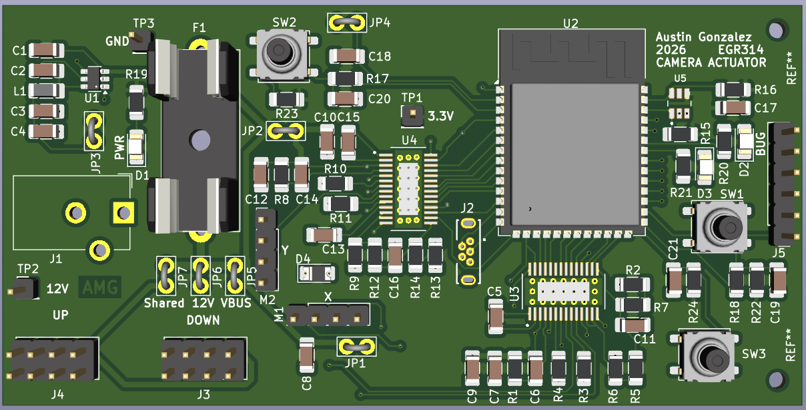
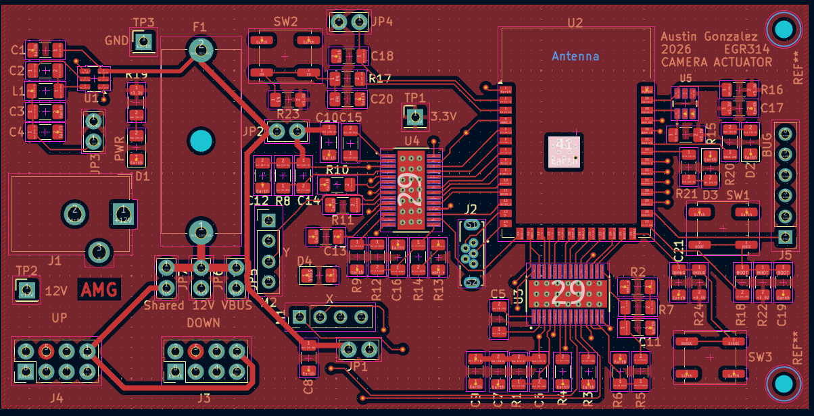
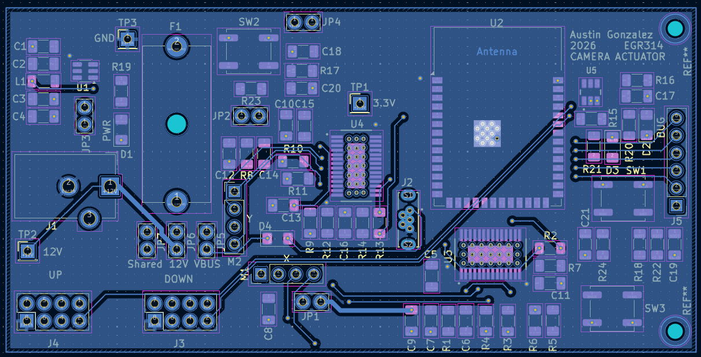

## Overview
my modules PCB is a 50x100mm 2 layer pcb that utlilizes the parts listed in the BOM. 
## 3D Rendering of PCB
 
## Front side copper

## Back side copper
 

## Resouces

The PCB as a Zip folder can be downloaded [*here*](EGR314CameraActuator5.0.zip).